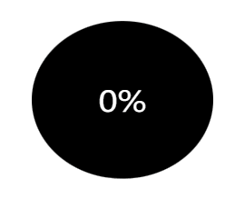

## 什么是E-DataV?

* E-DataV是一个基于**Vue3**的数据可视化组件库（[Vue2版本](https://github.com/costaq/E-DataV)）
* 提供数据可视化大屏所需的各种组件，朋友写的[DataV](https://github.com/DataV-Team/DataV)组件库中已有的组件，我这边不会过多增加，最多是效果提升
* 因工作原因及个人比较佛系，更新会比较慢，但会持续更新


### npm安装

```shell
$ npm install e-datav-vue3
```

### 使用

```js
import Vue from 'vue'
import EDataV from 'e-datav-vue3'
// 全局全部组件注册
Vue.use(EDataV)

// 按需引入，全局注册
import { DigitalFlop } from 'e-datav-vue3'
Vue.use(DigitalFlop)

// 单组件内按需引入
<script setup>
import { EDigitalFlop } from 'e-datav-vue3';
</script>

```

### UMD版

```js

<body>
    <div id="app">
        <e-full-screen-container>
            <e-digital-flop :value="9999" separator="," color="#c75151"></e-digital-flop>
        </e-full-screen-container>
    </div>
</body>
<script src="https://unpkg.com/vue@3/dist/vue.global.prod.js"></script>
<script src="https://unpkg.com/e-datav-vue3/umd/e-datav-vue3.umd.js"></script>
<script>
    const { createApp } = Vue;
    const { EDigitalFlop, EFullScreenContainer } = EDataV;

    const App = createApp();
    App.component('EDigitalFlop', EDigitalFlop);
    App.component('EFullScreenContainer', EFullScreenContainer);
    App.mount('#app');
</script>

```

### 组件介绍

#### 数字翻牌器

```js

// Portal.vue
<template>
    <div>
        <e-digital-flop />
    </div>
</template>
<script setup>
import { EDigitalFlop } from 'e-datav-vue3';
</script>
```
##### 效果演示


##### 可选参数
字段|类型|备注
-|-|-
value|Number|数值，默认1000
decimals|Number|小数点，默认0
duration|Number|持续时间，默认3000毫秒
fontSize|Number|字体大小，默认50
fontFamily|String|字体，默认液晶字体，传空值则恢复正常浏览器字体
color|String|颜色，默认#000
separator|String|千位分隔符，默认''


#### 水位图

```js

// Portal.vue
<template>
    <div>
        <e-water-level-pond :width="200" :height="200" :value="56" :background-color="'#000'" />
    </div>
</template>
<script setup>
import { EWaterLevelPond } from 'e-datav-vue3';
</script>
```
##### 效果演示



##### 可选参数
字段|类型|备注
-|-|-
value|Number|数值，必填
height|Number|高度，默认为100%，根据父元素拉伸
width|Number|宽度，默认为100%，根据父元素拉伸
decimals|Number|小数点，默认0
duration|Number|数字变动时动画持续时间，默认3000毫秒
fontSize|Number|字体大小，默认36
fontColor|String|颜色，默认#000
backgroundColor|String|背景色颜色，默认transparent透明
waveColors|String[]|水波颜色，默认['#41a9e3', '#b0e0ff']，第一个参数为前波浪，后一个参数为后波浪


#### 全屏组件

根据屏幕尺寸，自动拉伸

```js

// Portal.vue
<template>
    <div>
        <e-full-screen-container>
            <div>
                <e-digital-flop />
            </div>
        </e-full-screen-container>
    </div>
</template>
<script setup>
import { EDigitalFlop, EFullScreenContainer } from 'e-datav-vue3';
</script>

```

##### 可选参数
字段|类型|备注
-|-|-
type|String|数值，默认'full', 其他可选类型：full（全屏拉伸） full-width（宽度拉伸 ）full-height（高度拉伸）initial （默认不拉伸）
width|Number|大屏设计稿宽度，也就是公司设计师出的效果图尺寸，默认1920
height|Number|大屏设计稿高度，默认1080


#### 边框组件

边框组件1

```js

// Portal.vue
<template>
    <div style="width:200px;height:200px;">
        <e-border-box-1>
            <e-digital-flop />
        </e-border-box-1>
    </div>
</template>
<script setup>
import { EDigitalFlop, EBorderBox1 } from 'e-datav-vue3';
</script>

```

##### 效果演示


##### 可选参数
字段|类型|备注
-|-|-
borderRadius|Number|边框圆角，默认值3
borderWidth|Number|边框宽度，默认值3
colors|String[]|渐变颜色，默认值['#5ddcff', '#4e00c2']，只接受2个值
duration|Number|动画持续时间，默认值4，单位秒